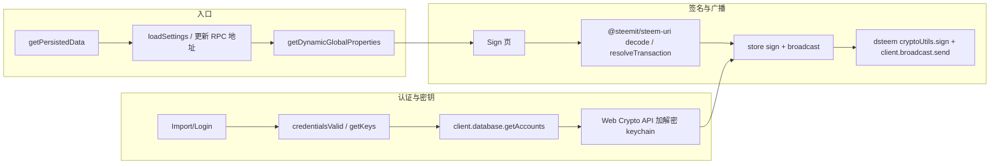

# AuthSteem Legacy 重构计划

## 一、旧版程序概览

### 1.1 技术栈与结构


| 维度        | 旧版 (legacy)                                      |
| --------- | ------------------------------------------------ |
| 框架        | Vue 3 + Vue Router 4 + Vuex 4 + Vue I18n         |
| 构建        | Vue CLI 5 (Webpack), Less                        |
| 包管理       | npm                                              |
| Steem SDK | **dsteem** (0.11.x)                              |
| 其他关键依赖    | @steemit/steem-uri (0.2.1), bs58, lodash, query-string |
| 运行形态      | Web 单页、Chrome 扩展、Electron 桌面（重构目标仅为 **Web 单页**）  |


**目录与入口：**

- 入口：`src/main.js`（依赖 `persisted.js` 取 store/url 后挂载 App）
- 路由：`src/router.js`（按 isWeb 区分 history、hash 及默认页）
- 状态：`src/store/`（modules: auth, ui, persistentForms, settings）
- 视图：`src/views/`（Home, Import, Login, Dashboard, Auths, Sign, Authorize, Revoke, Profile, Settings, Accounts, Apps, Developers, DevTools/BroadcastOp, 404 等）
- 与 Steem 相关逻辑：`src/helpers/auth.js`、`src/helpers/client.js`、store 的 `auth.js` / `settings.js`
- 扩展（本次重构不实现）：`public/background.js`、contentscript、popup 用 `index.html`；Electron（本次重构不实现）：`electron-entry.js`

### 1.2 核心业务流程（与 Steem 强相关）




- **RPC 使用**：`client`（dsteem `Client`）提供 `database.getAccounts`、`database.call`（如 get_dynamic_global_properties、get_config）、`broadcast.send`；`client.updateClient(address)` 切换节点。
- **认证**：支持「用户名+密码」派生 key 与「WIF 私钥」两种方式；`auth.js` 中 `getUserKeysMap` 用 `client.database.getAccounts([username])` 取 account 的 memo_key / owner/active/posting key_auths，再校验或取 key。
- **签名**：store 的 `sign` 用 `privateKeyFrom`（WIF）或 dsteem `PrivateKey.fromLogin`，再 `cryptoUtils.signTransaction(tx, [privateKey], chainId)`。
- **广播**：store 的 `broadcast` 直接 `client.broadcast.send(tx)`（已签名的 tx）。
- **Sign 页**：`resolveTransaction(parsed, signer)` 用 `client.database.getDynamicGlobalProperties` + `@steemit/steem-uri` 的 `resolveTransaction` 得到可签名 tx；然后 store sign → broadcast；回调/重定向用 `resolveCallback`。

### 1.3 与 steem-js next 的 API 对应关系（需落地的映射）


| 旧版 (dsteem/legacy)                                          | steem-js next 对应                                                                                                                                                                                                                                                                           |
| ----------------------------------------------------------- | ------------------------------------------------------------------------------------------------------------------------------------------------------------------------------------------------------------------------------------------------------------------------------------------ |
| `new Client(url)`，`client.updateClient(url)`                | `new Api({ url })`，`api.setUrl(url)` / `steem.config.set({ nodes: [url] })`                                                                                                                                                                                                                |
| `client.database.getAccounts([name])`                       | 需用 **condenser_api.get_accounts** 返回格式（memo_key, owner/active/posting.key_auths）。当前 steem-js `methods.ts` 仅有 `database_api.get_accounts`，返回结构可能与 condenser 不同。**建议**：新应用里用 `api.callAsync('condenser_api.get_accounts', [[username]])` 取账号，或为 steem-js 增加 condenser get_accounts 的封装并在此复用。 |
| `client.database.call('get_dynamic_global_properties', [])` | `api.getDynamicGlobalPropertiesAsync()`（由 methods 生成，对应 database_api）。                                                                                                                                                                                                                     |
| `client.database.call('get_config', [])`                    | `api.getConfigAsync()`（database_api.get_config）。注意 legacy 写的是 `config.STEEM_ADDRESS_PREFIX` / `STEEM_CHAIN_ID`，需与 steem-js 的 config 字段名对齐。                                                                                                                                                 |
| `PrivateKey.fromLogin(u,p,role)`                            | `Auth.getPrivateKeys(name, password, [role])` 或 `PrivateKey.fromSeed(name+role+password)`（与 Auth 内部一致）。                                                                                                                                                                                    |
| WIF → PrivateKey                                            | `PrivateKey.fromWif(wif)`；公钥：`priv.toPublic().toString()`。                                                                                                                                                                                                                                 |
| `cryptoUtils.signTransaction(tx, [privateKey], chainId)`    | `Auth.signTransaction(trx, [wif1, wif2, ...])`（入参为 WIF 字符串数组；chain_id 从 config 读）。                                                                                                                                                                                                         |
| `client.broadcast.send(signedTx)`                           | 已签名 tx：`api.broadcastTransactionAsync(signedTx)` 或 `api.send('network_broadcast_api', { method: 'broadcast_transaction_synchronous', params: [signedTx] }, cb)`。                                                                                                                           |
| `resolveTransaction`（ref_block_* + expiration）              | steem-js `broadcast._prepareTransaction` 可生成 ref_block_num/prefix 和 expiration；若继续用 **@steemit/steem-uri@0.2.1** 的 `resolveTransaction`，则用 `api.getDynamicGlobalPropertiesAsync()` 取 head_block_number / head_block_id，再调该包。                                                                          |


**结论**：  

- 认证与账号结构依赖 **condenser 风格** 的 get_accounts；新应用应统一用 condenser_api 取账号或在 steem-js 中封装一层。  
- 签名/广播、config、动态全局属性均可直接使用 steem-js 的 Api + Auth + config。

---

## 二、目标技术栈与工程结构

- **包管理**：pnpm  
- **语言与框架**：TypeScript + React 18  
- **构建与开发**：Vite  
- **UI**：shadcn/ui（基于 Tailwind + Radix）  
- **Steem**：通过 **pnpm 安装 steem-js 的 next 版本**（如 `@steemit/steem-js@next` 或发布后的 next 标签包），不作为 workspace 本地引用。  
- **状态管理**：**Zustand**（替代 Vuex）。  
- **路由**：React Router 6  
- **i18n**：react-i18next 或保持 JSON 文案 + 简单 hook  
- **部署 / Docker**：使用 **Alpine 底包**，由 **nginx 提供编译后的静态文件**（无 Node 运行时）。  
- **范围**：**仅 Web 单页应用**；**移除全部 OAuth / 授权相关功能**；仅保留「浏览器前端签名」与「开发工具」等本地能力；**暂不考虑 Chrome 扩展**；**暂不考虑 Electron**。

**新应用结构（与 legacy 并列，位于 authsteem 根目录）：**

```
authsteem/
  legacy/           # 保留不动（旧版 Vue 应用）
  src/              # 新应用源码
    main.tsx
    App.tsx
    routes.tsx
    lib/
      steem.ts      # 封装 steem-js Api/Auth/config、节点切换
      keychain.ts   # localStorage keychain + Web Crypto API 加解密
      steem-uri.ts  # 薄封装 @steemit/steem-uri@0.2.1 的 decode/resolveTransaction/resolveCallback
    stores/         # Zustand stores
    components/
    pages/          # 对应原 views
    hooks/
    i18n/
  public/
  index.html
  package.json
  vite.config.ts
  tsconfig.json
  Dockerfile        # Alpine + nginx，产出物为 dist 静态文件
```

---

## 三、分阶段重构任务

### 阶段 1：工程与 Steem 接入

1. **初始化 Vite + React + TypeScript 项目**（在 authsteem 下新目录）
  - `pnpm create vite` 或手动搭；配置 path alias（如 `@/`）；无需与 steem-js 同 monorepo。
2. **接入 shadcn/ui**
  - 按官方文档初始化 Tailwind + shadcn；按需添加 Button, Input, Card, Select, Dialog, Toast 等，替代原 Less + 手写样式。
3. **引入 steem-js**
  - 通过 **pnpm 安装 steem-js 的 next 版本**（例如 `pnpm add @steemit/steem-js@next` 或对应 next 标签）；在 `lib/steem.ts` 中：
    - 创建并导出 Api 单例（或可配置的工厂）；
    - 封装 `setNodeUrl(url)`（内部 `api.setUrl` / config.set）；
    - 封装获取账号：`getAccountsCondenser(names: string[])` 使用 `api.callAsync('condenser_api.get_accounts', [names])`（或后续 steem-js 提供的 condenser 封装）；
    - 封装 `getDynamicGlobalProperties`、`getConfig`（若 steem-js 已有 getConfig/get_config 则直接复用）。
4. **封装认证与密钥逻辑（替代 auth.js + 部分 store）**
  - 实现「用户名+密码」与「WIF」两种方式：
    - 用 steem-js 的 `Auth.getPrivateKeys` / `PrivateKey.fromWif` + 上一步的 `getAccountsCondenser` 实现 `credentialsValid`、`getKeys`；
    - 保持与 legacy 一致的 key 结构（active/posting/memo）。
  - 签名：`Auth.signTransaction(trx, keysWif[])`；广播：`api.broadcastTransactionAsync(signedTx)`。
5. **resolveTransaction 与 @steemit/steem-uri**
  - 使用 **@steemit/steem-uri@0.2.1**（`pnpm add @steemit/steem-uri@0.2.1`），用于 `decode`、`resolveTransaction`、`resolveCallback`、`encodeOps`（DevTools 等）。
  - 在 `lib/steem-uri.ts`（或 helpers）中实现 `resolveTransaction(parsed, signer)`：
    - 用 steem-js 的 `getDynamicGlobalPropertiesAsync()` 取 head_block_number、head_block_id；
    - 计算 ref_block_num、ref_block_prefix、expiration（与 legacy/client.js 一致）；
    - 调用 `@steemit/steem-uri` 的 `resolveTransaction(parsed.tx, parsed.params, { ... })` 得到可签名 tx。
  - 这样 Sign 页逻辑可尽量与旧版一致，仅把 RPC 与签名换成 steem-js。

### 阶段 2：状态、路由与核心页面

1. **全局状态与持久化（Zustand）**
  - **Settings**：语言、超时、主题、RPC 地址等存 localStorage；启动时 `loadSettings` 并调用 `setNodeUrl(settings.address)`；若需 chain_id/address_prefix，从 `getConfig` 拉取并缓存。可用 Zustand store（如 `useSettingsStore`）持久化到 localStorage。
  - **SigningIdentity（替代 Auth/OAuth）**：仅用于前端签名。
    - 浏览器侧可缓存已导入的私钥（WIF）集合（如 active/posting/memo），以及“账号名 -> 加密后的 keys payload”（使用 **Web Crypto API** 加密，格式：PBKDF2 + AES-GCM）。
    - 允许用户在签名页**临时输入私钥**（不落盘）或选择已缓存账号并输入 keychain 密码解锁后签名。
    - 不实现任何 OAuth / 授权 token / redirect 登录流程。
  - **Keychain**：使用 **Web Crypto API**（PBKDF2 + AES-GCM）加解密；`keychain` 读写 localStorage（与 legacy keychain key 一致，但加密格式不同）；实现 `getKeychain`、`addToKeychain`、`removeFromKeychain`、`hasAccounts`；**仅支持 Web Crypto 格式，不再支持 legacy triplesec**。
  - **范围**：暂不实现 Chrome 扩展（无 background/contentscript、popup 消息等）。
2. **路由**
  - React Router 6；**移除 OAuth/授权相关路由**，仅保留签名与基础工具（仅 Web）：
    - `/`（Home，可选）
    - `/sign/*`（核心：从 URL 解析待签名内容并展示）
    - `/settings`（RPC 节点等设置）
    - `/dev-tools/broadcast-op`（开发工具，维持 legacy 功能）
    - `*`（404）
  - 仅 Web 单页：使用 history 模式；无需区分扩展/Electron 的 hash 模式。
3. **核心页面迁移（按优先级）**
  - **Sign（核心）**：
    - 从 URL（`/sign/*` + querystring）构造待解析的 `steem:` / `web+steem:` / `ext+steem:` 链接并 `decode()`。
    - （可选）兼容 legacy 旧格式链接：移植 `legacyUriToParsedSteemUri` + `operations.json`。
    - 展示 Operation 列表（按 `operations.json` schema 渲染，替代直接 JSON dump）。
    - `resolveTransaction` → 选择 signer（URL 指定 signer 或用户选择）→ 使用用户输入的 WIF 或已解锁的缓存 keys 签名。
    - `no_broadcast` 支持：仅签名返回 signature；否则 broadcast 并展示 txid。
    - callback 支持：如存在 callback，使用 `resolveCallback` 进行 Web redirect。
  - **KeyManager（可作为 Sign 的一部分或单独页/弹窗）**：
    - 导入账号（用户名+密码派生 keys 或直接 WIF），可选择是否写入 keychain（Web Crypto API 加密）。
    - 解锁已缓存账号（keychain 密码）以供签名页使用。
  - **Settings**：RPC 地址变更调用 `setNodeUrl` 并刷新 config。
  - **DevTools/BroadcastOp**：**保持原有功能**（encodeOps + broadcast），仅替换底层 SDK 为 steem-js。

### 阶段 3：UI、i18n 与 Docker 部署

1. **组件与样式**
  - 用 shadcn 组件替换原 Vue 组件（Header, Footer, Center, Modal, Operation 展示等）；保留 `operations.json` 的 schema 用于展示与校验；必要时保留或移植 `operations.json` 与 `getLowestAuthorityRequired` 等工具。
2. **国际化**
  - 将 `translation.json`、`number.json`、`messages.json` 迁到 react-i18next 或简单 JSON + useTranslation 的 hook；文案 key 与 legacy 对应便于对照。
3. **Docker 构建与运行**
  - 使用 **Alpine** 作为基础镜像；构建阶段用 Node 构建前端（`pnpm install` + `pnpm build`），产出 `dist`。
  - 运行阶段使用 **nginx**，将 `dist` 复制到 nginx 静态目录（如 `/usr/share/nginx/html`），配置 nginx 对 SPA 做 fallback 到 `index.html`（history 模式）。
  - 不包含 Chrome 扩展、Electron；仅提供 Web 静态资源服务。

### 阶段 4：测试与收尾

1. **端到端与回归**
  - 覆盖：导入账号、登录、Sign 页（decode → resolve → sign → broadcast）、Settings 切换节点、keychain 加解密。
2. **文档与清理**
  - README 中说明新栈、pnpm 脚本、环境变量、与 legacy 的差异；注明依赖的 steem-js 版本与 condenser_api 使用方式。

---

## 四、风险与待确认点

1. **condenser_api.get_accounts**
   - legacy 使用的账号结构（memo_key, owner/active/posting.key_auths）来自 condenser；steem-js 当前 methods 里是 database_api.get_accounts。若 database_api 返回结构一致可直接用；否则新应用应显式调用 `condenser_api.get_accounts`（或在 steem-js 中新增该方法封装）。建议在重构前用 steem-js 对目标节点各调一次两个 API，确认返回字段一致。
2. **@steemit/steem-uri 与 steem-js 的 tx 格式**
  - `resolveTransaction` 产出的 tx 需与 steem-js 的 `Auth.signTransaction` 及 serializer 期望的格式一致（ref_block_num/ref_block_prefix 类型、expiration 格式等）。若 @steemit/steem-uri 与 steem-js 的序列化有细微差异，可能需要在 resolve 之后做一次字段兼容或 roundtrip 测试。
3. **keychain 加密方案** ✅ **已完成迁移**
   - **使用 Web Crypto API**（更现代、浏览器原生支持、无需额外依赖）。
   - 加密方案：PBKDF2（派生密钥，100000 次迭代）+ AES-GCM（加密 keys JSON）。
   - **仅支持 Web Crypto 格式**：不再支持 legacy triplesec 格式。
   - 存储格式：`{ version: 'webcrypto-v1', salt: hex, iv: hex, ciphertext: hex }`（JSON 字符串）。
   - 实现位置：`src/lib/keychain-crypto.ts`（Web Crypto API 核心实现）、`src/lib/keychain-helpers.ts`（便捷导出）。
4. **Chrome 扩展 / Electron 范围**
   - 本计划**暂不考虑 Chrome 扩展与 Electron**；仅实现 Web 单页应用。扩展与桌面版可列为后续迭代。

---

## 五、建议实施顺序小结

1. 新建 Vite+React+TS 工程，**pnpm 安装 steem-js next 版本**。
2. 实现 `lib/steem.ts`（Api、节点切换、condenser get_accounts、getConfig、getDynamicGlobalProperties）。
3. 实现认证与密钥层（credentialsValid、getKeys、keychain、Web Crypto API 加密/解密）。
4. 实现 resolveTransaction + @steemit/steem-uri@0.2.1 封装；实现 sign + broadcast（Auth.signTransaction + api.broadcastTransactionAsync）。
5. 接入 shadcn，使用 **Zustand** 实现 Settings/Keychain/SigningIdentity 状态与持久化，实现路由。
6. 按页面迁移：Sign（核心）→ KeyManager（导入/解锁）→ Settings → DevTools/BroadcastOp。
7. i18n、**Docker（Alpine + nginx 提供 dist 静态文件）**、测试与文档。

本计划仅覆盖 Web 单页；Chrome 扩展与 Electron 暂不实施。
